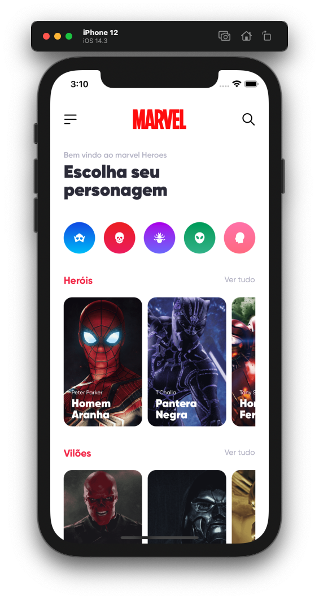

<h1 align="center">
    <a href="https://umpontoseis.com/" target="_blank">
      
    </a>
</h1>

<h1 align="center">
    
</h1>

<h4 align="center">
  🚀 umpontoseis - Marvel Heroes
</h4>

<p align="center">
  <a href="#-projeto">Projeto</a>&nbsp;&nbsp;&nbsp;|&nbsp;&nbsp;&nbsp;
  <a href="#-layout">Layout</a>&nbsp;&nbsp;&nbsp;|&nbsp;&nbsp;&nbsp;
  <a href="#rocket-tecnologias">Tecnologias</a>&nbsp;&nbsp;&nbsp;|&nbsp;&nbsp;&nbsp;
  <a href="#rocket-executando">Executando</a>&nbsp;&nbsp;&nbsp;|&nbsp;&nbsp;&nbsp;
  <a href="#memo-licença">Licença</a>
</p>
<br>

## 💻 Projeto

Este é o segundo projeto da **[umpontoseis](https://umpontoseis.com/)** criado de designers para desenvolvedores. A ideia do aplicativo é apresentar personagens do universo Marvel, em uma interface simples, elegante e com alto padrão.

## 🎨 Layout

<p align="center">
    
    
    
    
    
    
</p>

Você pode utilizar a seguinte URL para visualizar todas as telas: [Visualizar](https://www.figma.com/community/file/849367817302905364)

## :rocket: Tecnologias

Esse projeto foi desenvolvido com as seguintes tecnologias:

- [Typescript](https://www.typescriptlang.org/)
- [React Native](https://reactnative.dev/)

\* Para mais detalhes, veja o <kbd>[package.json](./package.json)</kbd>

## :notebook: Executando

### Pré-requisitos

É necessário que um simulador android/ios esteja rodando, ou um aparelho fisico.

```bash
# Clone este repositório
$ git clone https://github.com/willmorim/marvel-heroes.git
# Acesse a pasta do projeto no seu terminal/cmd
$ cd marvel-heroes
# Instale as dependências
$ yarn install
# Execute a aplicação
$ yarn start
```

## :construction: Como contribuir para o projeto

1. Faça um **fork** do projeto.
2. Crie uma nova branch com as suas alterações: `git checkout -b my-awesome-feature`
3. Salve as alterações e crie uma mensagem de commit contando o que você fez: `git commit -m "feature: My awesome feature"`
4. Envie as suas alterações: `git push origin my-awesome-feature`
   > Caso tenha alguma dúvida confira este [guia de como contribuir no GitHub](https://github.com/firstcontributions/first-contributions)
## :memo: Licença

Esse projeto está sob a licença MIT. Veja o arquivo [LICENSE](LICENSE.md) para mais detalhes.

---

Feito com amor por [William Amorim](https://www.linkedin.com/in/willmorim/)
